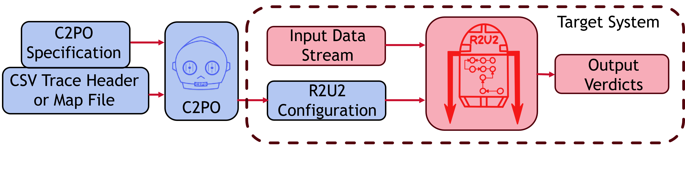
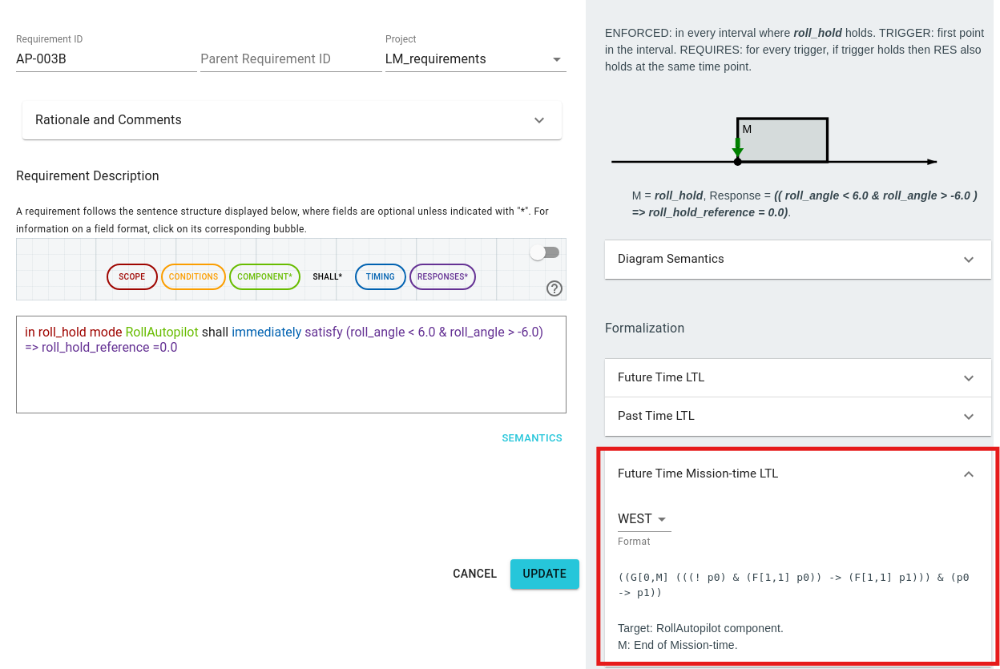

# R2U2
The [Realizable, Reconfigurable, Unobtrusive Unit (R2U2)](https://github.com/R2U2/r2u2) is a stream-based runtime verification framework based on Mission-time Linear Temporal Logic (MLTL) designed to monitor safety- or mission-critical systems with constrained computational resources.

Given a specification and input stream, R2U2 will output a stream of verdicts computing whether the specification with respect to the input stream. Specifications can be written and compiled using the Configuration Compiler for Property Organization (C2PO).

Through our FRET-To-R2U2 integration, we allow users to write requirements using the intuitive language of FRET, automatically formalize them, and export MLTL specifications in a C2PO specification file along with an example csv trace header file and map file for mapping input signals into R2U2. The C2PO specification and either the example csv trace header or map file can then be given as input to C2PO to create an R2U2 configuration.

> [!NOTE]
> Because MLTL doesn't reason over unbounded temporal operators, if a temporal operator must hold for the entire trace, one will observe `M`, which indicates the end of mission-time, as the upper bound of the interval. A warning comment will be included in the C2PO file as larger temporal intervals require extra memory resources.

## The FRET-R2U2 integration workflow

The figure below shows the workflow of R2U2.  Initially, requirements written in FRETish are translated by FRET into pure Future Time Mission-time Linear Temporal Logic (MLTL) formulas. MLTL is a variant of LTL over finite traces with bounded, closed, and discrete intervals on temporal intervals. Variables data must be provided by the user regarding the requirement variables (e.g., data types and variable types). The MLTL formulas and the variables data are used to generate a C2PO specification. An example [csv trace header file and map file](https://r2u2.github.io/r2u2/_collections/c2po_docs/user/signal_mapping.html) are also generated for mapping input signals into R2U2. The C2PO specification and either the example csv trace header or map file can then be given as input to C2PO to create an R2U2 configuration. The R2U2 configuration will configure the C and Rust versions of R2U2. For more information on R2U2, refer to R2U2's [documentation](https://r2u2.github.io/r2u2/). There is also an [online playground](https://r2u2.temporallogic.org/playground/) available to quickly run and experiment with the R2U2 configuration. 

## Optional WEST MLTL Validation

For validation of MLTL specifications, the requirement update dialog box provides an optional [WEST](https://west.temporallogic.org/) output.

> [!NOTE]
> With the WEST format, one will need to manually specify `M` (i.e., the end of mission-time).

***

[Back to Analysis Portal page](./analysis.md)

[Back to FRET home page](../userManual.md)
